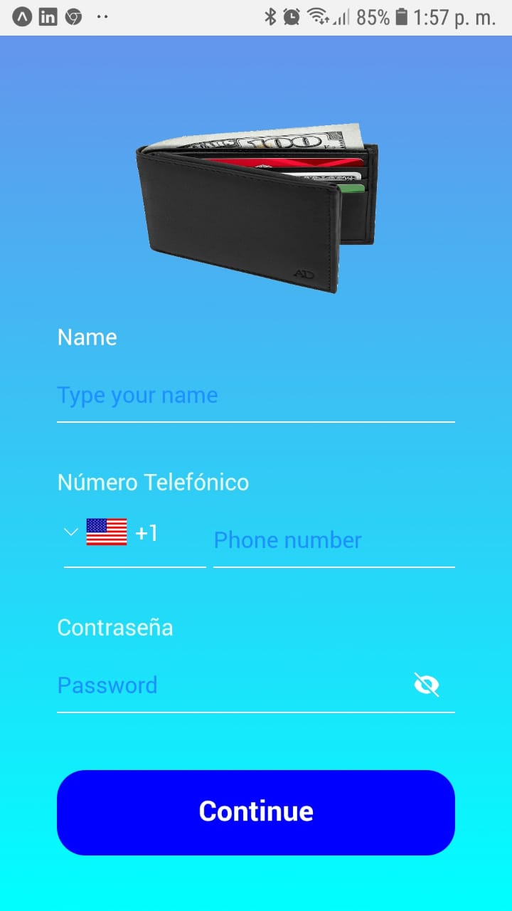

# Digital wallet
 


Digital wallet is a small app developed using React Native with Javascript and the Framework EXPO

It is not a functional one, but has all the components a real one should have

It is composed of three main screens: User, Home and Scan

In the User screen, which is the screen that appears when the app is launched, the user has the opportunity to type his/her name, the phone number along with the country code, and the password

In the home screen, several dummy items are shown: features and special promotions, clicking on any of them will only show an alert

The Scan screen is where the actual reading is made, the screen shows a focus rectangle, and when the camera recognizes a QR code, it automatically processes it

## Installation

Create a directory in you hard drive where the project will live

If you haven't installed expo cli yet, run the following command

```cmd
npm install expo-cli –global
```

In order to install the project, you have to first clone the project in your directory using git clone, from [github](https://github.com/rafaelsoteldosilva/billetera-digital)

Once you've cloned it, you have to run the following commands from the command line or bash:

```cmd
expo init .

npm install @react-navigation/native @react-navigation/stack @react-navigation/drawer @react-navigation/bottom-tabs

expo install react-native-reanimated react-native-gesture-handler react-native-screens react-native-safe-area-context @react-native-community/masked-view expo-camera expo-web-browser expo-linear-gradient
```

## Structure of the project

The project is structured using 4 main folders:

Assets  
&nbsp;&nbsp;&nbsp;&nbsp;fonts  
&nbsp;&nbsp;&nbsp;&nbsp;icons  
&nbsp;&nbsp;&nbsp;&nbsp;images  

*(The contents are self explanatory)*

Constants  
&nbsp;&nbsp;&nbsp;&nbsp;icons.js  
&nbsp;&nbsp;&nbsp;&nbsp;images.js  
&nbsp;&nbsp;&nbsp;&nbsp;index.js  
&nbsp;&nbsp;&nbsp;&nbsp;theme.js  

index,js is used to be able to import all other three files using just one instruction, like:
```js
import { COLORS, SIZES, FONTS, icons, images } from "../constants"
```

navigation  
&nbsp;&nbsp;&nbsp;&nbsp;Tabs.js

Tabs.js is the component used by App.js to display the bottom tabs when the user is watching the Home screen

screens  
&nbsp;&nbsp;&nbsp;&nbsp;Home.js  
&nbsp;&nbsp;&nbsp;&nbsp;Scan.js  
&nbsp;&nbsp;&nbsp;&nbsp;SignUp.js  
## General Process

App.js declares the variable 
```js
const NavigatorWithDrawer = createDrawerNavigator();
```
Which is used to create two main components that will be displayed in the drawer: Tab and SignUp

The SignUp module shows the registration screen, where the user types name, phone and password

The Tab module defines three screens: Home itself, Scan and User

This two modules will be present by default in the drawer

Home is set as the initial route
```js
<Tab.Navigator
    initialRouteName="Home"
```
When the user presses the **Continue** button, the app navigates to the **Home** component, where several dummy options are shown, *Special Features and Special Promotions*

The app then shows the bottom-tab buttons home, scan and user

If the user opens the drawer, two options are shown, the same options defined in App.js when NavigatorWithDrawer was defined

If the user presses the scan bottom tab, the scan module is rendered, where the special \<Camera\> component is used, this component specifies all we need to use the camera
```js
            <Camera
                ref={(ref) => {
                    this.camera = ref;
                }}
                style={{ flex: 1 }}
                captureAudio={false}
                type={Camera.Constants.Type.back}
                flashMode={Camera.Constants.FlashMode.off}
                onBarCodeScanned={onBarCodeRead}
                androidCameraPermissionOptions={{
                    title: "Permission to use the camera",
                    message:
                        "Camera is required in order to read QR codes",
                    buttonPositive: "OK",
                    buttonNegative: "Cancel",
                }}
            >
                {renderHeader()}
                {renderScanFocus()}
                {renderPaymentMethods()}
            </Camera>
```

In case the camera recognizes the code, it executes onBarCodeRead, which, if we use the QR code presented in https://reactnativemaster.com/react-native-qr-code-scanner-using-expo/, a redirection is made to the wikipedia website: https://en.m.wikipedia.org/wiki/Main_Page 

Note that special constants are used, as Camera.Constants.Type.back and Camera.Constants.FlashMode.off, they are in the Camera component we imported with:
```js
import { Camera } from "expo-camera";
```

(*In order to show the wallet image with no background, I got rid of it using photoshop*)